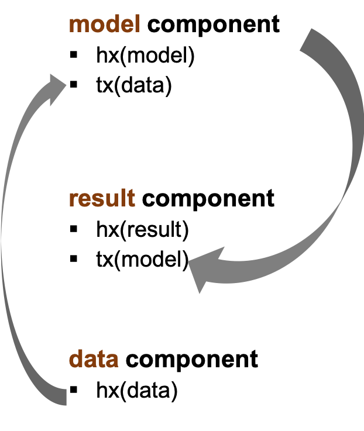

# Blockchain-backed analytics

## Introduction

“Blockchain-backed analytics” (BBA), is a scalable and easy-to-use generic approach to introduce quality gates to data science projects, backed by the immutable records of a blockchain.
Data, models and results are stored as cryptographically hashed fingerprints with mutually linked transactions in a public blockchain database in order to enable stakeholders of data science projects to track and trace the linkage of data, applied models and modeling results without the need of trust validation of escrow systems or any other third party.

<p align="center">
  
</p>

Read the [full paper](http://dx.doi.org/10.4995/CARMA2018.2018.8292) for more details:
>Herrmann et al. (2018): *Blockchain-backed analytics. Adding blockchain-based quality gates to data science projects.* Proceedings of the 2nd International Conference on Advanced Research Methods and Analytics. Editorial Universitat Politècnica de València, València, 2018.


The BBA application enables you to create & manage a trusted analytics projects via a graphical (browser based) solution and to track past projects and lookup & visualize the corresponding data-model-result linkage. New Components can be registered in the Ethereum blockchain in an intuitive way.


## Installation instructions for BBA

### Overview

BBA consists of 3 parts:
1.	A database (PostgreSQL)
2.	A backend system (based on NodeJS and NestJS)
3.	A frontend application (based on AngularJS)

BBA will be deployed with two Docker containers:
-	The database container
-	The app container

Prerequisites: 
-	Docker 
-	NodeJS 


# Deployment

## Install libraries

Please run this command in /backend and /frontend

```bash
npm install
```

## Change config files

You can search for # TODO to find all places where you should put your configuration data in. This is especially the file

```bash
backend/Config/Backend/.env.prod
```

This file will be copied to .env during build


## Rebuild the frontend

If you made any changes to the frontend code, you'll have to rebuild the frontend and copy the compiled code to the backend folder "/backend/Source/src/public". 
The frontend will be distributed by the backend.
Run in the frontend folder:

```bash
npm run integrate
```

## Create containers

Alternatively, docker-compose can be used to deploy a version straight
from a pre-build docker hub GfK BBA image (running dummy accounts only)

```bash
cd gfk-bba-backend/
docker-compose up -d
```
The application is accessible at: `http://localhost:80`
